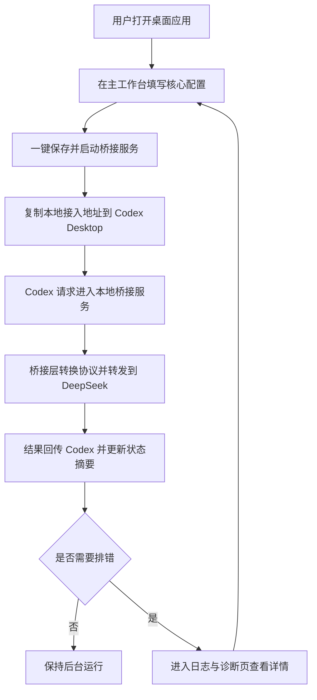

## 1. 产品概述
为 Codex Desktop 提供一个可视化本地桥接程序，将 Codex 所需协议转换为 DeepSeek 可消费的请求，并通过类似 `cc-switch` 的轻量桌面界面完成配置、启动与状态查看。
- 解决用户必须手工编辑配置、手动启动桥接服务、缺少状态反馈的问题，目标用户为希望快速接入 DeepSeek 的个人开发者与小团队。
- 产品价值在于用最短操作路径完成接入，尽量把首次配置、后续启动、问题定位都压缩到一个清晰工作台中，并产出 Windows 与 macOS Apple Silicon 桌面版本。

## 2. 核心功能

### 2.1 功能模块
1. **主工作台**：服务状态、当前监听地址、DeepSeek 连接表单、快速启动与停止、最近日志摘要。
2. **日志与诊断页**：实时日志、错误筛选、健康检查、端口占用检测、脱敏请求摘要。
3. **偏好设置抽屉**：开机自启、最小化到托盘、日志保留、导入导出配置。

### 2.2 页面详情
| 页面名称 | 模块名称 | 功能描述 |
|-----------|-------------|---------------------|
| 主工作台 | 服务状态卡片 | 展示运行中、已停止、异常三种状态，并显示监听地址、端口、最近错误 |
| 主工作台 | 快捷操作区 | 支持一键启动、停止、重启桥接服务，以及复制本地接入地址 |
| 主工作台 | DeepSeek 配置表单 | 在同一屏中编辑 Base URL、API Key、默认模型、超时等核心参数 |
| 主工作台 | 高级配置折叠区 | 收纳模型映射、请求头映射、重试次数等不常修改项 |
| 主工作台 | 接入指引区 | 展示 Codex Desktop 侧需填写的本地地址与简短说明 |
| 主工作台 | 最近日志摘要 | 只展示最近几条关键日志，便于快速判断是否接通 |
| 日志与诊断页 | 实时日志流 | 以列表形式展示请求时间、路径、耗时、状态码、错误信息，支持筛选和清空 |
| 日志与诊断页 | 请求详情抽屉 | 查看脱敏后的请求体与响应摘要，帮助定位协议转换问题 |
| 日志与诊断页 | 健康检查 | 执行 DeepSeek 可达性检测、本地监听检测、配置完整性校验 |
| 偏好设置抽屉 | 桌面行为 | 配置开机自启、关闭按钮行为、托盘常驻、窗口记忆尺寸 |
| 偏好设置抽屉 | 数据管理 | 导出配置、导入配置、清理日志、查看应用版本与运行平台 |

## 3. 核心流程
用户首次打开应用后，直接在主工作台填写 DeepSeek 接口、API Key 与默认模型，保存后即可一键启动本地桥接服务。应用在后台启动 Go 服务并监听本地端口，用户将该地址填入 Codex Desktop 后即可开始使用。若接入失败，用户仍停留在同一工作台即可先看状态和最近日志，只有在需要深入排查时才进入日志与诊断页。

## 4. 用户界面设计
### 4.1 设计风格
- 主色为深色石墨灰与低饱和蓝绿色强调色，整体参考 `cc-switch` 的工具型桌面风格，克制、清晰、轻量。
- 按钮采用中等圆角与清晰边界，主操作突出但不过度装饰，危险操作使用低饱和警示红。
- 字体建议前端使用 `Avenir Next` / `Segoe UI` / `PingFang SC` 级联，标题 24-32，正文 13-15，状态数据使用等宽字体以强化工具属性。
- 布局采用顶部标题栏 + 主工作台双栏结构，默认先看到状态卡与配置表单，不强调复杂导航层级。
- 图标采用线性图标风格，避免花哨插画，重点强化状态圆点、开关、复制、日志等高频操作。

### 4.2 页面设计概览
| 页面名称 | 模块名称 | UI 元素 |
|-----------|-------------|-------------|
| 主工作台 | 服务状态卡片 | 简洁信息卡、运行状态圆点、等宽数字、弱对比描边、轻量动画 |
| 主工作台 | 快捷操作区 | 主按钮、次按钮、复制图标按钮、短提示条 |
| 主工作台 | DeepSeek 配置表单 | 紧凑表单、密码输入框、模型下拉、表单校验反馈、保存提示 |
| 主工作台 | 高级配置折叠区 | 折叠面板、键值对编辑器、帮助说明文本、测试按钮 |
| 日志与诊断页 | 实时日志流 | 表格或虚拟列表、状态标签、筛选器、搜索框、滚动跟随开关 |
| 日志与诊断页 | 请求详情抽屉 | JSON 展示区、脱敏标记、复制按钮、错误定位提示 |
| 偏好设置抽屉 | 桌面行为 | 开关组件、分组项、平台说明文案、危险操作确认弹窗 |

### 4.3 响应式
- 采用桌面优先设计，默认以 1180-1320 宽度体验为主。
- 最低支持 920 宽度窗口，较窄窗口下工作台由双栏压缩为上下布局。
- 不以移动端为目标，但保留窗口缩放和高分屏适配能力，适配 Windows 与 macOS 常见桌面分辨率。

### 4.4 交互与体验补充
- 启动服务时展示分阶段反馈，包括配置检查、端口绑定、健康探测结果。
- 所有日志与请求详情默认脱敏显示 API Key、授权头与敏感请求片段。
- 启动失败时提供明确可执行建议，例如端口冲突、目标接口不可达、模型未配置。
- 桌面应用关闭时支持“退出应用”与“最小化到托盘”两种行为。
- 交互原则以“少页面、少弹窗、少学习成本”为先，尽量让首次接入在 1 个主界面内完成。
