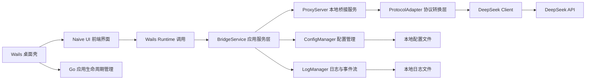
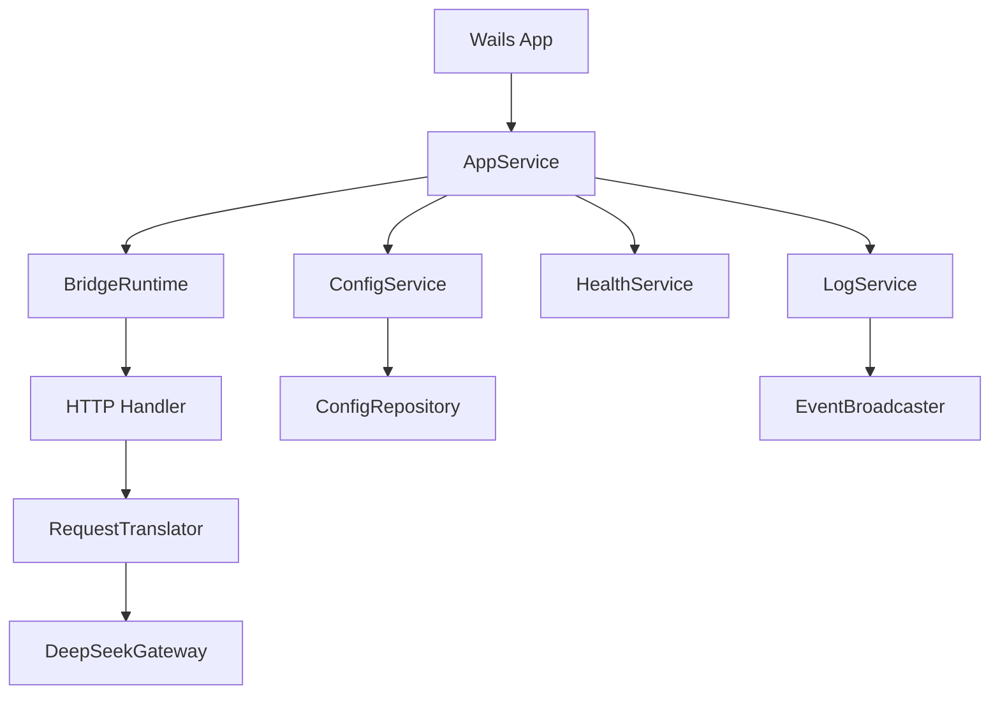
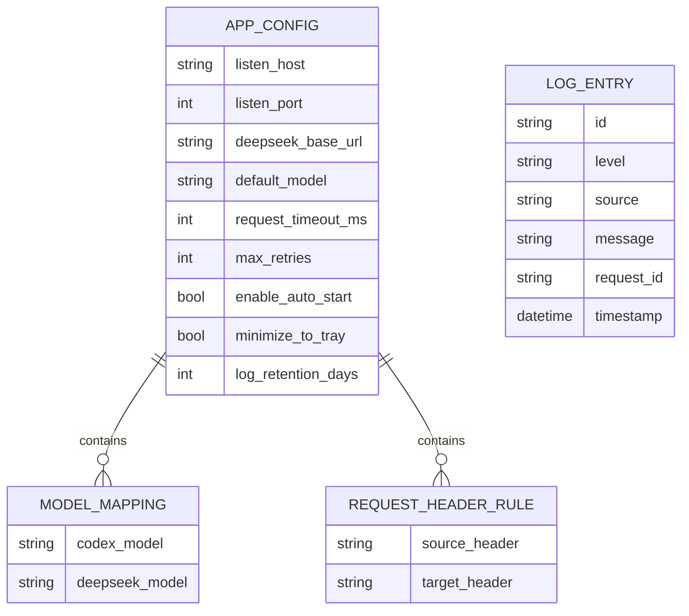

## 1. 架构设计


## 2. 技术说明
- 桌面框架：Wails v2，使用 Go 作为宿主进程与业务后端。
- 前端框架：Vue 3 + TypeScript + Vite。
- UI 组件库：Naive UI。
- 状态管理：Pinia。
- 路由：Vue Router，但以“单主工作台 + 辅助页/抽屉”为主，减少跳转层级。
- 数据通信：Wails Bindings + Events，前端调用 Go 方法并订阅日志/状态事件。
- 本地服务：Go `net/http` 实现桥接代理，按需扩展 SSE/流式响应转发。
- 配置存储：本地 JSON 配置文件，按平台写入用户目录。
- 日志：结构化文本日志 + 前端事件推送，日志内容统一脱敏。
- 构建目标：`windows/amd64` 与 `darwin/arm64` 为首批发布目标，界面交互参考 `cc-switch` 的轻量工具面板风格。

## 3. 路由定义
| 路由 | 用途 |
|-------|---------|
| /overview | 主工作台，聚合状态、核心配置、快速操作与最近日志摘要 |
| /logs | 查看实时日志、诊断结果与请求详情 |
| /settings | 承载偏好设置内容，也可在主界面抽屉中打开 |

## 4. API 定义
### 4.1 Wails 前后端绑定接口
```ts
type BridgeStatus = "stopped" | "starting" | "running" | "error";

interface AppConfig {
  listenHost: string;
  listenPort: number;
  deepseekBaseURL: string;
  apiKey: string;
  defaultModel: string;
  requestTimeoutMs: number;
  maxRetries: number;
  enableAutoStart: boolean;
  minimizeToTray: boolean;
  logRetentionDays: number;
  compactMode: boolean;
  mappings: Record<string, string>;
}

interface HealthCheckResult {
  ok: boolean;
  checks: Array<{
    name: string;
    ok: boolean;
    message: string;
  }>;
}

interface LogEntry {
  id: string;
  level: "info" | "warn" | "error";
  timestamp: string;
  source: "app" | "proxy" | "healthcheck";
  message: string;
  requestId?: string;
}
```

### 4.2 Wails 方法约定
| 方法名 | 说明 |
|-------|------|
| `GetAppConfig()` | 读取本地配置并返回前端初始表单数据 |
| `SaveAppConfig(config)` | 校验并持久化配置 |
| `StartBridge()` | 启动本地桥接服务 |
| `StopBridge()` | 停止本地桥接服务 |
| `RestartBridge()` | 重启本地桥接服务 |
| `GetBridgeStatus()` | 获取当前服务状态与监听地址 |
| `GetOverviewSnapshot()` | 获取主工作台所需的聚合数据，包括状态、配置摘要与最近日志 |
| `RunHealthCheck()` | 执行目标接口可达性和本地端口检查 |
| `GetLogHistory(limit)` | 获取历史日志 |
| `ExportConfig()` | 导出配置文件 |
| `ImportConfig(payload)` | 导入配置文件并校验 |

### 4.3 本地桥接 HTTP 接口
| 路径 | 方法 | 说明 |
|------|------|------|
| /v1/chat/completions | POST | 接收 Codex 兼容请求并转换为 DeepSeek 聊天请求 |
| /v1/models | GET | 返回可用模型列表或映射后的静态模型数据 |
| /health | GET | 返回本地桥接服务健康状态 |

## 5. 服务端架构图


## 6. 数据模型
### 6.1 数据模型定义


### 6.2 数据定义
```text
配置文件：app-config.json
- listenHost: 监听地址，默认 127.0.0.1
- listenPort: 监听端口，默认 11434 或项目约定端口
- deepseekBaseURL: DeepSeek API 根地址
- apiKey: DeepSeek 访问密钥，持久化前做基础加密或最小可见存储
- defaultModel: 默认转发模型
- requestTimeoutMs: 请求超时
- maxRetries: 转发失败后的重试次数
- enableAutoStart: 应用启动后是否自动拉起桥接服务
- minimizeToTray: 关闭主窗口时是否进入托盘
- logRetentionDays: 日志保留天数
- mappings: 模型映射表

日志文件：bridge.log
- 采用按日期滚动策略
- 每条日志至少包含时间、级别、来源、消息、请求编号
- 敏感字段在落盘前统一脱敏
```

## 7. 关键实现约束
- 协议转换层保持与界面解耦，前端仅操作配置和状态，不直接参与请求拼装。
- Go 后端需支持并发请求转发、请求超时控制、统一错误包装与可观测日志输出。
- 前端日志视图需支持高频事件刷新，但避免一次性渲染过多条目，优先采用虚拟列表或分页策略。
- 所有与密钥相关的展示必须默认掩码，仅在用户主动操作时短暂查看。
- 主界面优先呈现高频操作，低频配置通过折叠区或设置抽屉收纳，保持类似 `cc-switch` 的低学习成本。
- 发布流程需提供 Wails 构建脚本，保证能产出 Windows 与 macOS Apple Silicon 安装包或可执行文件。
